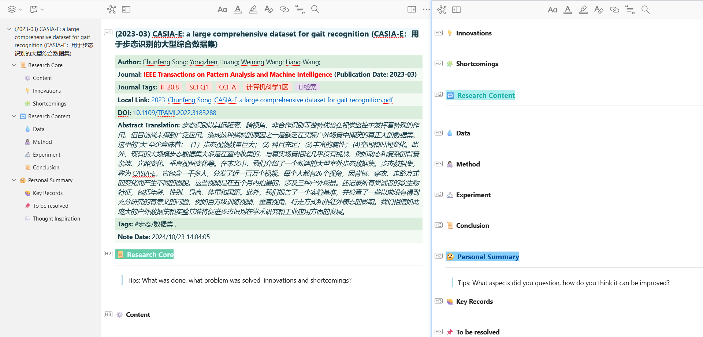
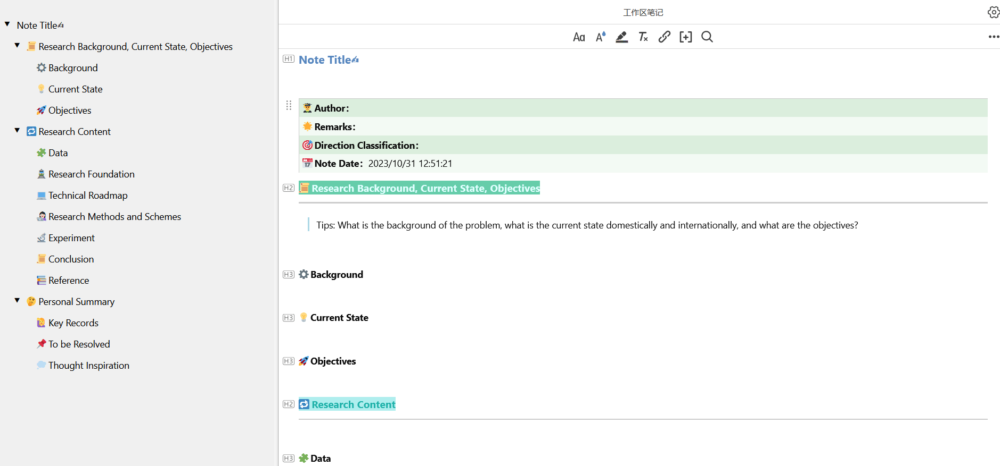

# zotero-better-plugin

Make zotero7 plugins better, including note templates, tag actions, etc.

## zotero7 recommended plugins

- [zotero-addons](https://github.com/syt2/zotero-addons) - A Zotero Add-on for collecting and installing add-ons in Zotero. Zotero 插件商店。
- [zotero-pdf-translate](https://github.com/windingwind/zotero-pdf-translate) - Translate PDF, EPub, webpage, metadata, annotations, notes to the target language. Support 20+ translate services.
- [zotero-better-notes](https://github.com/windingwind/zotero-better-notes) - Everything about note management. All in Zotero.
- [zotero-better-bibtex](https://github.com/retorquere/zotero-better-bibtex) - Make Zotero effective for us LaTeX holdouts.
- [jasminum](https://github.com/l0o0/jasminum) - A Zotero add-on to retrive CNKI meta data. 一个简单的 Zotero 插件，用于识别中文元数据。
- [zotcard](https://github.com/018/zotcard) - A card note-taking enhancement tool, write cards quickly while reading.
- [zotero-gpt](https://github.com/MuiseDestiny/zotero-gpt) - Use ChatGPT to search and ask items based on the selected text or the PDF file.
- [zotero-style](https://github.com/MuiseDestiny/zotero-style) - Ethereal Style for Zotero. Modifies columns and adds some interesting ones. [Latest version](https://gitee.com/MuiseDestiny/plugins/raw/master/zotero-style.xpi).
- [zotero-actions-tags](https://github.com/windingwind/zotero-actions-tags) - Action it, tag it, sorted.
- [zotero-reference](https://github.com/MuiseDestiny/zotero-reference) - PDF references add-on for Zotero.
- [zotero-pdf-preview](https://github.com/windingwind/zotero-pdf-preview) - Preview Zotero attachments in the library view.
- [zotero-format-metadata](https://github.com/northword/zotero-format-metadata) - Linter for Zotero. An addon for Zotero to format item metadata.
- [zotero-attanger](https://github.com/MuiseDestiny/zotero-attanger) - Attachment Manager for Zotero. Zotfile reimplementation for zotero7.
- [tara](https://github.com/l0o0/tara) - A Zotero add-on for backup and restore preferences, add-ons, translators, styles, and locate between two machines.
- [zotero-citation](https://github.com/MuiseDestiny/zotero-citation) - Make Zotero's citation in Word easier and clearer.
- [zotero-figure](https://github.com/MuiseDestiny/zotero-figure) - A PDF chart parsing add-on based on PDFFigure2
- [delitemwithatt](https://github.com/redleafnew/delitemwithatt) - Remove attachments when delete the items or collections in Zotero and JurisM.
- [notero](https://github.com/dvanoni/notero) - Syncing items and notes into Notion.

## zotero other links

- [Zotero7 Beta Builds](https://www.zotero.org/support/beta_builds) - Zotero7 官方下载链接。
- [zotero-chinese](https://zotero-chinese.com) - Zotero 中文小组，维护 Zotero 中文文档、教程等。
- [Chinese-STD-GB-T-7714-related-csl](https://github.com/redleafnew/Chinese-STD-GB-T-7714-related-csl) - 中文CLS样式（参考文献样式）。
- [translators_CN](https://github.com/l0o0/translators_CN) - Zotero translator中文网页抓取翻译器。
- [easyScholar](https://www.easyscholar.cc) - 在论文搜索网站上显示期刊等级，配合 zotero-style 插件可在 Zotero 内显示期刊标签。

## zotero-better-notes

[Note Discussions](https://github.com/windingwind/zotero-better-notes/discussions)

### Note Templates

- [Paper Note](./zotero-better-notes/[Item]PaperNote.md)
  
  - `MetaData` : Auto extract Author, Journal, Journal Tags, Local Link, DOI, Abstract, Note Date, etc.
  - `DOI` : Show `url` if the DOI does not exist.
  - `Abstract` : Show `abstractTranslation` if the it exists. Otherwise, show `abstractNote`.

- [Main Note](./zotero-better-notes/[Text]MainNote.md)
  

- [Common Note](./zotero-better-notes/[Text]CommonNote.md)

## zotero-actions-tags

[Actions & Tags Discussions](https://github.com/windingwind/zotero-actions-tags/discussions)

### Actions

- [Toggle Left Pane](./zotero-actions-tags/ToggleLeftPane)
  - `Name` : Toggle Left Pane
  - `Event` : None
  - `Operation` : Script
  - `Data` : `ToggleLeftPane`
  - `Shortcut`: Shift + [

- [Toggle Right Pane](./zotero-actions-tags/ToggleRightPane)
  - `Name` : Toggle Right Pane
  - `Event` : None
  - `Operation` : Script
  - `Data` : `ToggleRightPane`
  - `Shortcut`: Shift + ]

- [New Paper Note](./zotero-actions-tags/NewPaperNote)
  - `Name` : New Paper Note
  - `Event` : None
  - `Operation` : Script
  - `Data` : `NewPaperNote`
  - `Shortcut`: None
  - `Menu Label`: New Paper Note

- [New Common Note](./zotero-actions-tags/NewCommonNote)
  - `Name` : New Common Note
  - `Event` : None
  - `Operation` : Script
  - `Data` : `NewCommonNote`
  - `Shortcut`: None
  - `Menu Label`: New Common Note

- [Copy Item Link](./zotero-actions-tags/CopyItemLink)
  - `Name` : Copy Item Link
  - `Event` : None
  - `Operation` : Script
  - `Data` : `CopyItemLink`
  - `Shortcut`: None
  - `Menu Label`: Copy Item Link

- [Merge Duplicate Item](./zotero-actions-tags/MergeDupItem)
  - `Name` : Merge Duplicate Item
  - `Event` : None
  - `Operation` : Script
  - `Data` : `MergeDupItem`
  - `Shortcut`: None
  - `Menu Label`: Merge Duplicate Item

- [Download PDF from Scihub](./zotero-actions-tags/PDFFromScihub)
  - `Name` : Download PDF From Scihub
  - `Event` : None
  - `Operation` : Script
  - `Data` : `PDFFromScihub`
  - `Shortcut`: None
  - `Menu Label`: Download PDF From Scihub

- [Format Chinese Annotations](./zotero-actions-tags/FormatChineseAnnotations)
  - `Name` : Format Chinese Annotations
  - `Event` : 新建注释 (New annotation)
  - `Operation` : Script
  - `Data` : `FormatChineseAnnotations`
  - `Shortcut`: None
  - `Menu Label`: Format

## zotero-gpt

[Command Tags Discussions](https://github.com/MuiseDestiny/zotero-gpt/discussions)

### Command Tag

- [期刊评价](./zotero-gpt/JournalEvaluation)

- [方法总结](./zotero-gpt/MethodSummary)

- [创新点](./zotero-gpt/Innovation)

- [摘要转综述](./zotero-gpt/AbstractToReview)

- [数学公式解释](./zotero-gpt/MathSolver)

## zotcard

[zotcard Discussions](https://github.com/018/zotcard/discussions/2)
