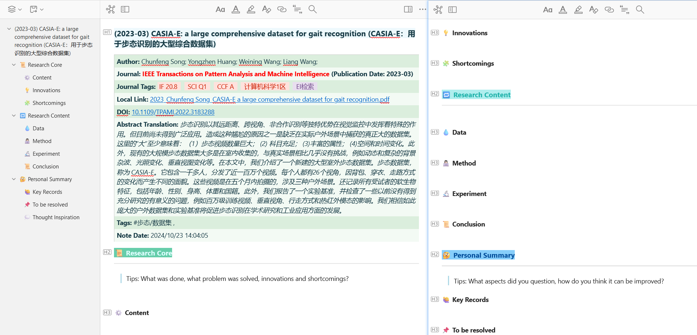
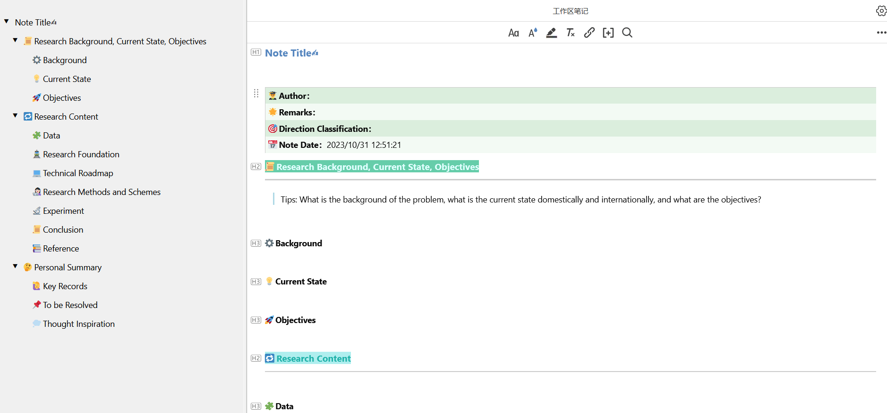

# zotero-better-plugin

Enhance Zotero 7, 8, and 9 with recommended plugins, essential resources, note templates, tag actions, and more.

## zotero recommended plugins

- [zotero-addons](https://github.com/syt2/zotero-addons) - A Zotero Add-on for collecting and installing add-ons in Zotero. Zotero 插件商店。
- [zotero-pdf-translate](https://github.com/windingwind/zotero-pdf-translate) - Translate PDF, EPub, webpage, metadata, annotations, notes to the target language. Support 20+ translate services.
- [zotero-better-notes](https://github.com/windingwind/zotero-better-notes) - Everything about note management. All in Zotero.
- [llm-for-zotero](https://github.com/yilewang/llm-for-zotero) - A research agent system deeply rooted in your own Zotero library.
- [zotero-pdf2zh](https://github.com/guaguastandup/zotero-pdf2zh) - Zotero PDF中文翻译插件，在Zotero中使用[PDF2zh](https://github.com/Byaidu/PDFMathTranslate)和[PDF2zh_next](https://github.com/PDFMathTranslate-next/PDFMathTranslate-next)。
- [zotero-better-bibtex](https://github.com/retorquere/zotero-better-bibtex) - Make Zotero effective for us LaTeX holdouts.
- [jasminum](https://github.com/l0o0/jasminum) - A Zotero add-on to retrive CNKI meta data. 一个简单的 Zotero 插件，用于识别中文元数据。
- [zotero-magic](https://gitee.com/zotero-chinese/zotero-magic-for-user) - PDF沉浸式全文翻译、文献总结、文献综述与文献矩阵。*Advanced features require payment.* [Latest version](https://gitee.com/zotero-chinese/zotero-magic-for-user/raw/master/zotero-magic-for-user.xpi).
- [zotero-gpt](https://gitee.com/MuiseDestiny/plugins) - Use ChatGPT to search and ask items based on the selected text or the PDF file. *Advanced features require payment.* [Latest version](https://gitee.com/MuiseDestiny/plugins/raw/master/zotero-gpt.xpi).
- [zotero-style](https://gitee.com/MuiseDestiny/plugins) - Ethereal Style for Zotero. Modifies columns and adds some interesting ones. *Advanced features require payment.* [Latest version](https://gitee.com/MuiseDestiny/plugins/raw/master/zotero-style.xpi).
- [zotero-reference](https://gitee.com/MuiseDestiny/plugins) - PDF references add-on for Zotero. *Advanced features require payment.* [Latest version](https://gitee.com/MuiseDestiny/plugins/raw/master/zotero-reference.xpi).
- [zotero-actions-tags](https://github.com/windingwind/zotero-actions-tags) - Action it, tag it, sorted.
- [zotero-format-metadata](https://github.com/northword/zotero-format-metadata) - Linter for Zotero. An addon for Zotero to format item metadata.
- [zotero-attanger](https://github.com/MuiseDestiny/zotero-attanger) - Attachment Manager for Zotero. Zotfile reimplementation for zotero7.
- [tara](https://github.com/l0o0/tara) - A Zotero add-on for backup and restore preferences, add-ons, translators, styles, and locate between two machines.
- [zotero-citation](https://github.com/MuiseDestiny/zotero-citation) - Make Zotero's citation in Word easier and clearer.
- [zotero-figure](https://github.com/MuiseDestiny/zotero-figure) - A PDF chart parsing add-on based on PDFFigure2
- [delitemwithatt](https://github.com/redleafnew/delitemwithatt) - Remove attachments when delete the items or collections in Zotero and JurisM.
- [zotero-scipdf](https://github.com/syt2/zotero-scipdf) - Download PDF from Sci-Hub automatically For Zotero.

## zotero other links

- [Zotero9 download](https://www.zotero.org/download/) - Zotero7 官方下载链接。[Zotero9 Beta Builds](https://www.zotero.org/support/beta_builds). [Zotero8 for Mac](https://www.zotero.org/download/client/dl?channel=release&platform=mac&version=8.0.5), [Zotero8 for Windows](https://www.zotero.org/download/client/dl?channel=release&platform=win-x64&version=8.0.4).
- [zotero-chinese](https://zotero-chinese.com) - Zotero 中文小组，维护 Zotero 中文文档、教程、插件及样式等。
- [Chinese-STD-GB-T-7714-related-csl](https://github.com/zotero-chinese/styles) - 中文CLS样式（参考文献样式）。
- [translators_CN](https://github.com/l0o0/translators_CN) - Zotero translator中文网页抓取翻译器。
- [easyScholar](https://www.easyscholar.cc) - 在论文搜索网站上显示期刊等级，配合 zotero-style 插件可在 Zotero 内显示期刊标签。

## zotero-better-notes

[Note Discussions](https://github.com/windingwind/zotero-better-notes/discussions)

### Note Templates

- [Paper Note](./zotero-better-notes/[Item]PaperNote.md)
  
  - `MetaData` : Auto extract Author, Journal, Journal Tags, Local Link, DOI, Abstract, Note Date, etc.
  - `DOI` : Show `url` if the DOI does not exist.
  - `Abstract` : Show `abstractTranslation` if the it exists. Otherwise, show `abstractNote`.

- [Main Note](./zotero-better-notes/[Text]MainNote.md)
  

- [Common Note](./zotero-better-notes/[Text]CommonNote.md)

## zotero-actions-tags

[Actions & Tags Discussions](https://github.com/windingwind/zotero-actions-tags/discussions)

### Actions

- [Toggle Left Pane](./zotero-actions-tags/ToggleLeftPane)

- [Toggle Right Pane](./zotero-actions-tags/ToggleRightPane)

- [New Paper Note](./zotero-actions-tags/NewPaperNote)

- [New Common Note](./zotero-actions-tags/NewCommonNote)

- [Copy Item Link](./zotero-actions-tags/CopyItemLink)

- [Merge Duplicate Item](./zotero-actions-tags/MergeDupItem)

- [Download PDF from Scihub](./zotero-actions-tags/PDFFromScihub)

- [Format Chinese Annotations](./zotero-actions-tags/FormatChineseAnnotations)

- [Add Unread When Create Item](./zotero-actions-tags/AddUnread)

- [Remove Unread When Close Tab](./zotero-actions-tags/RemoveUnread)

- [Auto Translate Item Title and Abstract](./zotero-actions-tags/TranslateTitleAbstract)

## zotero-gpt

[Command Tags Discussions](https://github.com/MuiseDestiny/zotero-gpt/discussions)

### Command Tag

- [期刊评价](./zotero-gpt/JournalEvaluation)

- [摘要总结](./zotero-gpt/AbstractSummary)

- [创新点](./zotero-gpt/Innovation)

- [方法总结](./zotero-gpt/MethodSummary)

- [文章总结](./zotero-gpt/PaperSummary)

- [数学公式解释](./zotero-gpt/MathSolver)

- [摘要批量转综述](./zotero-gpt/BatchAbstractSummary)

- [解释](./zotero-gpt/ExplainSelection)

- [改写](./zotero-gpt/RewriteSelection)

- [概括](./zotero-gpt/SummarizeSelection)
